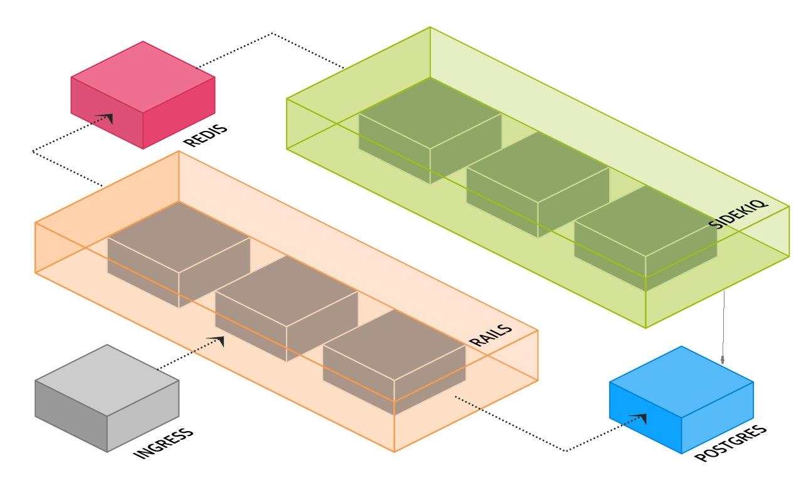

# Rails on K8S

This is a demo for developing rails applications utilizing docker and docker-compose and deploying on kubernetes cluster.

## Application stack

- Rails 4.2 on ruby 2.2.3
- Unicorn for serving the static and dynamic resources 
- Sidekiq job worker
- Redis for cahce and job queues
- Postgres DB

## Architecture Diagram

 This is a typical deployment strategy for rails on k8s thought I'm not covering the Ingress part for now I'll update it later.

## Main Directories
I have separated this repo into two directories the "instademo" for the development part utilizing docker and docker-compose for spinning up a development environment (see dedicated [readme](https://github.com/ghozln/rails-on-k8s/tree/master/instademo)).
Also see the [k8s-readme](https://github.com/ghozln/rails-on-k8s/tree/master/k8s) for creating all necessary elements for a kubernetes deployment.
